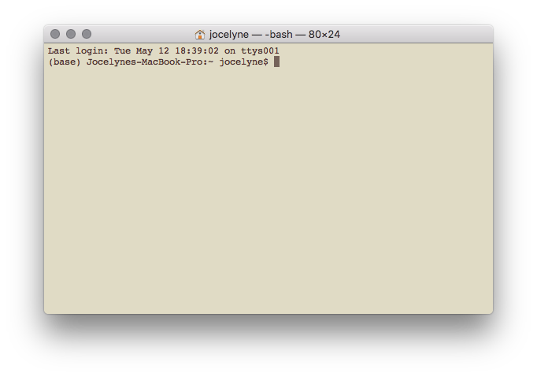
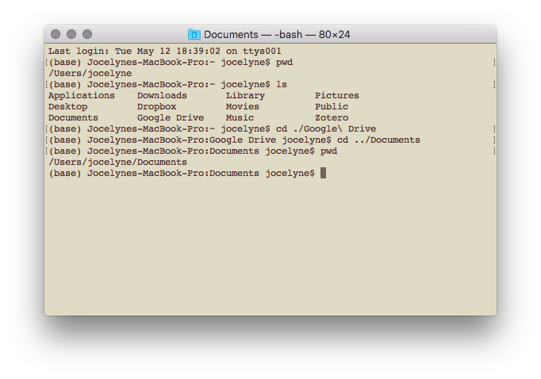
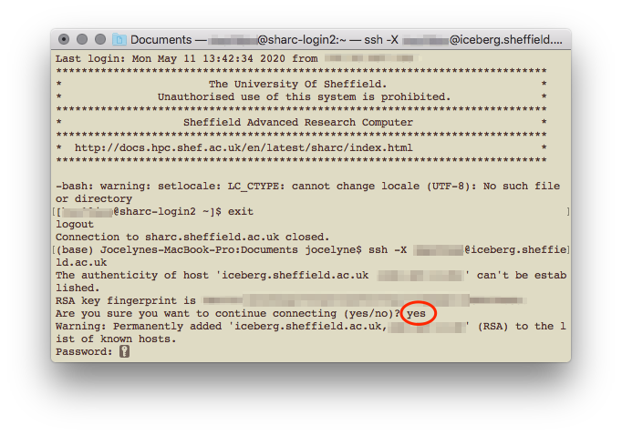
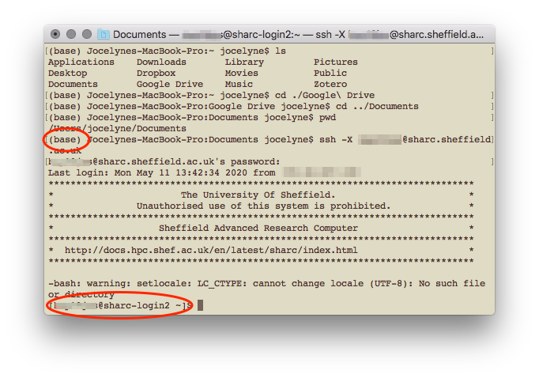

```{r setup, include=FALSE}
knitr::opts_chunk$set(echo = TRUE)
```

This document explains how to use R on the University of Sheffield's High Performance Computing clusters. R is only available on ~~Iceberg~~^1^ and ShARC, which are clusters managed using Son of Grid Engine job scheduling software (which is a derivative of Sun Grid Engine, or SGE). If you're googling how to submit jobs etc., make sure you're looking at SGE commands (and not Slurm which is another scheduler that is used on the Bessemer cluster).

Sheffield Advanced Research Computer (ShARC) is apparently the "new High Performance Computing System and the successor to Iceberg" and has [these specifications](https://docs.hpc.shef.ac.uk/en/latest/sharc/cluster_specs.html#sharc-specs). It has a total of 121 worker nodes and 2024 cores (though some are exclusive to research groups that purchased them). There are also 4 nodes with 16 cores and total memory of 256GB each. 

^1^ Iceberg will be decommissioned on 30 November 2020 & will not be accessible after this date. Iceberg is slightly older (with older processers) and has [these specifications](https://docs.hpc.shef.ac.uk/en/latest/iceberg/cluster_specs.html). Of relevance, there are about 203 worker nodes and a total of 3440 cores, they're built differently with varying numbers of cores and total memory. There are 4 nodes which have 16 cores and total memory of 256GB each. Iceberg does not require VPN connection to access, though I think during this work-from-home period, one does require the University of Sheffield's Virtual Private Network (VPN) to access Iceberg remotely.


## Using command line tools
On **macOS**, open a Terminal window (type 'Terminal' in Spotlight or search in Applications). I'm using macOS High Sierra 10.13.6.  

You should see your name and home folder.



For **Microsoft Windows** users, open a PowerShell terminal or Command Prompt, though the Sheffield HPC guide recommends using the browser application (myAPPs portal) to access the HPC, following the [instructions here](https://www.sheffield.ac.uk/it-services/research/hpc/using/access/browser). Once you've downloaded the necessary client (Oracle Secure Global Desktop Client) and logged in, there's the option to use an interactive job or a terminal.

## Other useful command line prompts
* `pwd` print current directory (or more commonly known as a folder)
* `cd another/directory` change directory
* `..` to go one level up
* `mkdir file/path/directoryName` create a directory
* `ls` to list all items in the current directory
* `mv old/file/path/fileName.ext new/file/path` to move a file to a different location. You can also use this to rename your files, like `mv oldFileName.ext newFileName.ext`
* `rm` to delete a file (! warning! this is permanent and cannot be undone)
* `rm file/path/*` to delete everything in a directory. To delete the directory itself, use `rm -r file/path`
* `cat fileName.ext` to print/view the contents of the file (all of it!)
* `head fileName.ext` to print/view the first few lines of the file

These commands are all relative to your current location. If you're running something on command line and want to cancel it (for e.g., I often try and log in to the HPC without being connected to the VPN and the prompt to enter password never appears), use `Ctrl + c` to "kill" the command. A useful tip I picked up while reading the many webpages is using `Ctrl + a` to move the cursor to the start of the command line. 




## Logging in to the HPC
You need to be connected to the University of Sheffield Virtual Private Network first. Once connected, type the following on your terminal
```{bash, eval=FALSE}
ssh -X UserName@sharc.sheffield.ac.uk
```

A prompt will appear for your password. On MacOS terminals, the password is not be printed as you type it, and if you make any mistakes or try to backspace, it'll return `Permission denied, please try again.`

The first time you log in from your computer, a prompt will appear asking if you do want to connect to the remote cluster. Type yes.

 

In the above screenshot, I was logged in to ShARC, before logging out and logging in to Iceberg for the first time. *I'm not sure what the `-bash: warning: setLocale: LC_CTYPE: cannot change locale (UTF-8): No such file or directory` warning means, it shouldn't appear but it also doesn't seem to have affected my use.*





Once you've logged in, you'll notice that instead of being in your computer `(base)`, you are now in a head node of the HPC `[UserName@sharc-loginX ~]`. At this point, you can access files but you can't load applications (like R); for that you need to be assigned to a worker node.

You can log in to Iceberg instead of ShARC by replacing 'sharc' with 'iceberg', as in UserName@iceberg.sheffield.ac.uk. Both these clusters have R available as an application, but the latest version of R on Iceberg is 3.3.1 compared to 3.6.3 (as of May 2020). Iceberg will also be decommissioned on 30 November 2020 and will not be accessible after.
