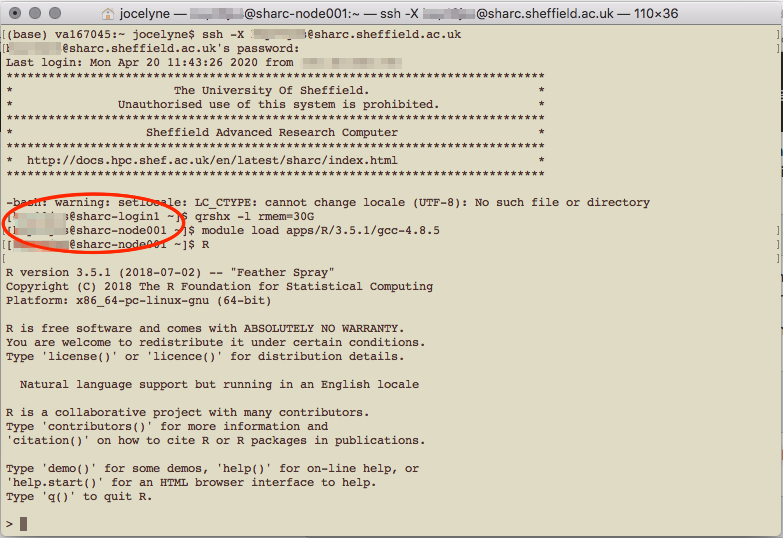
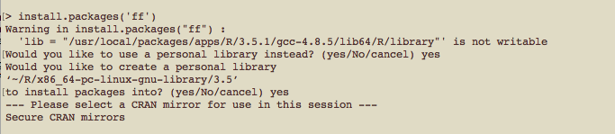
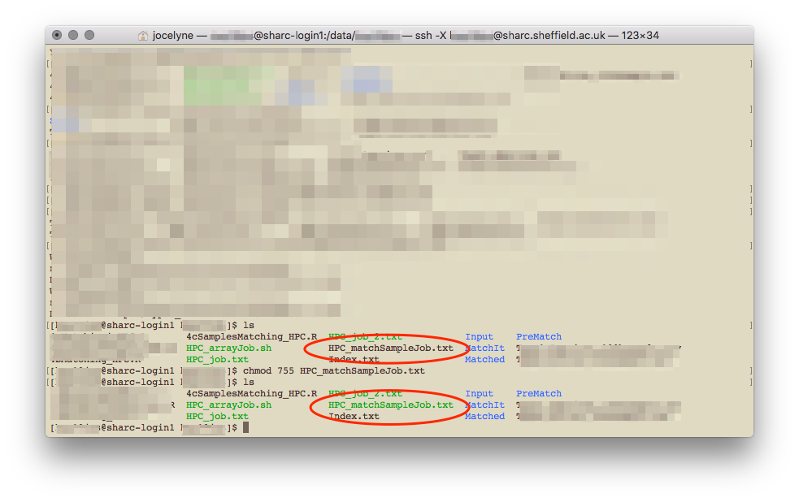
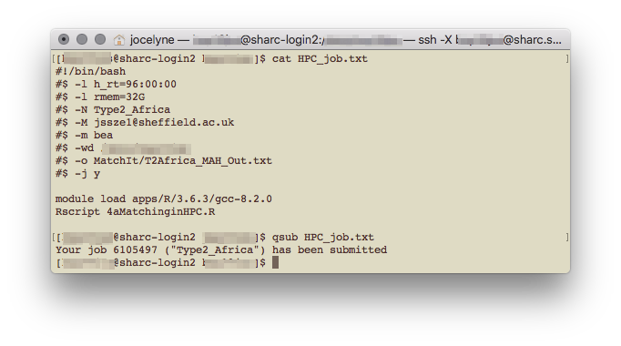
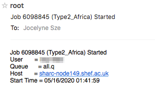
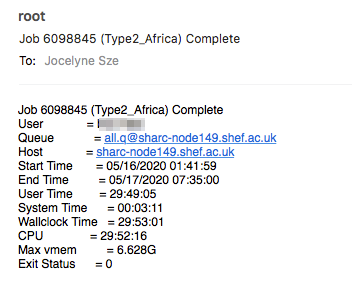
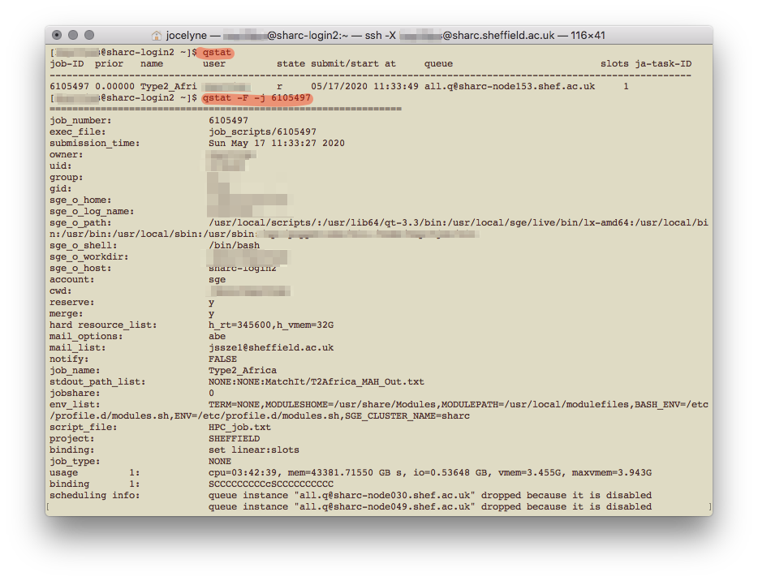

```{r setup, include=FALSE}
knitr::opts_chunk$set(echo = TRUE)
```

# Accessing the HPC
This document explains how to use R on the University of Sheffield's High Performance Computing clusters. R is only available on Iceberg and ShARC, which are clusters managed using Son of Grid Engine job scheduling software (which is a derivative of Sun Grid Engine, or SGE). If you're googling how to submit jobs etc., make sure you're looking at SGE commands (and not Slurm which is another scheduler that is used on the Bessemer cluster).

Iceberg is slightly older (with older processers) and has [these specifications](https://docs.hpc.shef.ac.uk/en/latest/iceberg/cluster_specs.html). Of relevance, there are about 203 worker nodes and a total of 3440 cores, they're built differently with varying numbers of cores and total memory. There are 4 nodes which have 16 cores and total memory of 256GB each. Iceberg does not require VPN connection to access, though I think during this work-from-home period, one does require the University of Sheffield's Virtual Private Network (VPN) to access Iceberg remotely.

Sheffield Advanced Research Computer (ShARC) is apparently the "new High Performance Computing System and the successor to Iceberg" and has [these specifications](https://docs.hpc.shef.ac.uk/en/latest/sharc/cluster_specs.html#sharc-specs). It has a total of 121 worker nodes and 2024 cores (though some are exclusive to research groups that purchased them). There are also 4 nodes with 16 cores and total memory of 256GB each. 

## Using command line tools
On OS X, open a Terminal window (type 'Terminal' in Spotlight or search in Applications). I'm using macOS High Sierra 10.13.6.  

You should see your name and home folder.


## Other useful command line prompts
* `pwd` print current directory (or more commonly known as a folder)
* `cd another/directory` change directory
* `..` to go one level up
* `mkdir file/path/directoryName` create a directory
* `ls` to list all items in the current directory
* `mv old/file/path/fileName.ext new/file/path` to move a file to a different location. You can also use this to rename your files, like `mv oldFileName.ext newFileName.ext`
* `rm` to delete a file (! warning! this is permanent and cannot be undone)
* `rm file/path/*` to delete everything in a directory. To delete the directory itself, use `rm -r file/path`
* `cat fileName.ext` to print/view the contents of the file (all of it!)
* `head fileName.ext` to print/view the first few lines of the file

These commands are all relative to your current location. If you're running something on command line and want to cancel it (for e.g., I often try and log in to the HPC without being connected to the VPN and the prompt to enter password never appears), use `Ctrl + c` to "kill" the command. A useful tip I picked up while reading the many webpages is using `Ctrl + a` to move the cursor to the start of the command line. 


For Microsoft Windows users, open a PowerShell terminal or Command Prompt, though the Sheffield HPC guide recommends using the browser application (myAPPs portal) to access the HPC, following the [instructions here](https://www.sheffield.ac.uk/it-services/research/hpc/using/access/browser). Once you've downloaded the necessary client (Oracle Secure Global Desktop Client) and logged in, there's the option to use an interactive job or a terminal.

## Logging in to the HPC
You need to be connected to the University of Sheffield Virtual Private Network first. Once connected, type the following on your terminal
```{bash, eval=FALSE}
ssh -X UserName@sharc.sheffield.ac.uk
```

A prompt will appear for your password. On MacOS terminals, the password is not be printed as you type it, and if you make any mistakes or try to backspace, it'll return `Permission denied, please try again.`

The first time you log in from your computer, a prompt will appear asking if you do want to connect to the remote cluster. Type yes.

 

In the above screenshot, I was logged in to ShARC, before logging out and logging in to Iceberg for the first time. *I'm not sure what the `-bash: warning: setLocale: LC_CTYPE: cannot change locale (UTF-8): No such file or directory` warning means, it shouldn't appear but it also doesn't seem to have affected my use.*


Once you've logged in, you'll notice that instead of being in your computer `(base)`, you are now in a head node of the HPC `[UserName@sharc-loginX ~]`. At this point, you can access files but you can't load applications (like R); for that you need to be assigned to a worker node.

You can log in to Iceberg instead of ShARC by replacing 'sharc' with 'iceberg', as in UserName@iceberg.sheffield.ac.uk. Both these clusters have R available as an application, but the latest version of R on Iceberg is 3.3.1 compared to 3.6.3 (as of May 2020). 

# Using R on the HPC
## Starting a job
Once logged in, you can use the HPC in interactive mode or to submit a batch job. I find it easier to start in interactive mode to see how it works and have a play around. If you've got everything written out and you just need the computer to do the work though, running a batch job is much easier and the job scheduler SGE will run the job without you worrying about it.

## In interactive mode
### Request a worker node
First we need to request for a worker node
```{bash, eval=FALSE}
qrshx -l rmem=16G -pe smp 4 
```

* `qrshx` supports graphical applications, as does `qsh`. The former is specific to Sheffield's clusters and is supposedly superior to the latter. `qrsh` does not support graphical applications, only command line shell
* `-l rmem=XXG` requests for specific real memory resources. Here I've asked for 16GB of memory; the default is 2GB, and the max one can request is 256GB. The amount of memory you're requesting for is for each core; so if you're requesting for four cores and you need 8G of RAM in total, you only need to request for 2G of rmem.
* `-pe smp X` requests for X number of cores on the same node. This is only useful if you're parallelising your code. `smp` stands for shared memory parallelisation where you're sharing the memory (in the case of Sheffield's HPC, all the cores have to be on the same node). On Iceberg, instead of `smp` it's `openmp`. The default number of core allocated is one and the max one can request is 16. 


You might have to wait a while to be allocated a worker node, or your request for a node might be rejected (for that particular time). Once you're allocated a node, the name changes from `[UserName@sharc-loginX ~]` to `[UserName@sharc-nodeXXX ~]`.

### Load R
Once you're on a worker node, you can open or load applications.

```{bash, eval=FALSE}
module load apps/R/3.6.3/gcc-8.2.0
```

This loads the particular version of R available on the HPC, which also happens to be the latest at this point in time. To load the latest without specifying which version, use `module load apps/R`.



In the above screenshot, I loaded R version 3.5.1, because according to the website, that was the latest version available. You can find out what modules/R versions are available on the system with `module avail` once you're logged in to the HPC.

If you're using the HPC interactively, to quit R, type `quit()` or `q()`. You will still be on a worker node, and to leave it, type `exit`. To leave the HPC system altogether, type `exit` again. You can open multiple terminal windows to, for example have R on one in a worker node, and just be logged in to the system to view files on the other. 

### Installing packages you need
When you first install packages, you need to create a home folder, which will be specific to each version of R you use.

When you type `install.packages('packageName')` in R, you will receive a warning, and respond that `yes`, you would like to use a personal library, and again that `yes`, you would like to create a personal library. 



You'll then have to select which CRAN mirror (I use 50, Bristol) to use. Subsequent packages that you install will automatically go into your personal library. To check what packages have been installed, in the head node (not in the R session), type `ls ~/R/x86_64-pc-linux-gnu-library/3.6/`. Or whatever version of R you might be using.

## In a scheduled batch job (serial)
Useful if you need substantial resources (>8 hours, or a few cores). You are allowed to submit up to 2000 jobs to the ShARC cluster and the scheduler will allow up to 200 of your jobs to run simultaneously (depending on the load on the cluster) [more here under FAQ](https://docs.hpc.shef.ac.uk/en/latest/hpc/scheduler/submit.html). The following guidance is for writing a serial batch job, where only one core is used. For parallel computing, see below section on [Parallel computing on the HPC cluster](#Learning-how-to-parallelise)

### Writing a bash script
A bash script is needed to submit a scheduled job. You can use a plain text editor like TextEdit on Mac OS to write it (which is what I've done). It seems that if you use Windows, it would be better to use Notepad++ and save the file in UNIX/OSX format, or to just use the terminal to write the bash shell script with a text editor. This is because Windows and Unix-like systems use different end-of-line characters in text files.

Start with a shebang (shell bang) `#!` for a bash script, specify various arguments (in SGE speech, not slurm), and call Rscript to run your R script. Here's an example

```{bash, eval=FALSE}
#!/bin/bash`
#$ -l h_rt=10:00:00
#$ -l rmem=16G
#$ -N jobName
#$ -M UserName@email.address
#$ -m bea
#$ -wd /file/path/to/directory
#$ -o /file/path/to/Output.txt
#$ -j y

module load apps/R/3.6.3/gcc-8.2.0
Rscript myTestScript.R
```
* `-l h_rt=XX:XX:XX` specifies the running time for the script in HH:MM:SS. After this time, the job will be killed regardless of its status (even if it hasn't finished!). The current maximum allowed is 96 hours (4 days) for ShARC and 168 hours (7 days) for Iceberg.
* `-l rmem=XXXG` specifies the amount of memory (for each core) required. If the job exceeds the allocated memory, the job will also be killed. 256G is the maximum available (since that's the maximum amount of memory available for a node). 
* `-N` specifies the name you want to give to the job, makes it easier to keep track of multiple jobs you're submitting, rather than trying to remember the job numbers for each of them.
* `-M` specifies the email address you want updates to be sent to.
* `-m bea` tells it to send an email (to the above specified address) when the job begins, ends, or is aborted.
* `-wd` specifies the working directory, or you could use `-cwd` for the current working directory (if you run the script from the directory you already want it to. You can also set the working directory within the R script itself...)
* `-o` specifies the output file. If you don't specify the file path, the output file will be in the working directory.
* `-j y` tells it to join the error and output file. Alternatively, if you want separate error and output files, use `-e /file/path/to/Error.txt` instead.
* the module load command is the same as what you would call in an interactive job
* `Rscript` runs the R script you have written. There are a few other ways of getting your R script done, such as `R CMD BATCH` and `littler` but apparently the former is terrible and I've not tried the latter.


Once you've got your bash script written, you need to make it executable. Go to your terminal again:
```{bash, eval=FALSE}
cd directory/your/bash/script/is/in
chmod 755 bashScript.ext
```
It apparently doesn't matter what your file extension is, whether it's .sh or .txt. It changes colour when the file has been made executable.




Once you've got your R script (written as you normally would, but make sure it doesn't require any interactive input) and your bash script written and saved to a directory that's accessible on the HPC, you're good to go! It's a generally good idea to test it out before submitting your real job.

#### Writing an executable R script
It seems there's another way of doing this which is to make your R script executable itself, and have your R script start with a shebang. I have not tried this and am not sure how it works. 

So your R script would look something like that
```{R, eval=FALSE}
#!/usr/bin/env Rscript

setwd('if/you/need/it')
library('Package')

# ... rest of script as normal
```

After you've done that, you need to make that R script executable by going to terminal and typing
`chmod +x myRScript.R`

Then you can apparently run the R script directly in Terminal, with `./myRscript.R` ...

### Submitting your batch job
Back in terminal, make sure you're connected on the VPN, logged in to the HPC using `ssh`. From the head node, you can submit your batch job with
```{bash, eval=FALSE}
qsub file/path/to/bashScript.ext
```



And that's it! Or, you can also navigate to the directory that your bash script sits in with `cd`, and run `qsub bashScript.ext` from there. 

If you've used the `-M` and `-m bea` options and submitted your job, the email sent to you when that job completes (assuming you've ) will tell you the maximum memory that job needed (**Max vmem**), and you can use that to determine the `-l rmem=XXG` parameter for your next job. 



After submitting your job, you can exit the HPC with `exit`. To check on the job, you have to log back in (making sure you're connected to VPN), and type `qstat`. This gives an update on all the jobs you have submitted. To get more details on a specific job, type `qstat -F -j JOB_NUMBER`


If you run into errors, you can also debug by going into interactive mode, loading the R module (but not running it) and try `Rscript myTestScript.R` to see what went wrong.

# Transferring files
You need to be connected on the VPN to transfer files, and use the terminal.

### From your computer to the remote cluster
```{bash, eval=FALSE}
scp your/file/path/and/filename.ext UserName@sharc.sheffield.ac.uk:/file/path
```
You'll be prompted to type your password. Your file path should be specified relative to your current working directory. 

To transfer folders/directories
```{bash, eval=FALSE}
scp -r your/file/path/to/directory UserName@sharc.sheffield.ac.uk:/file/path
```

### From the remote cluster to your computer
You should be connected on the VPN, but not logged in to the HPC
```{bash, eval=FALSE}
scp UserName@sharc.sheffield.ac.uk:/file/path/filename.ext your/computer/file/path
```
Again, you'll be prompted to type your password, and your computer file path should also be specified relative to your current working directory. Similarly, to transfer folders, just add `-r` after `scp`.

### File storage on the HPC
There are [several data storage repositories available](https://docs.hpc.shef.ac.uk/en/latest/hpc/filestore.html) to a HPC user:

* __Home directory__: `/home/UserName` which has 10GB of storage, available across system login and worker nodes and on ShARC and Iceberg. It is snapshotted and backed up. 
* __Data directory__: `/data/UserName` which has 100GB of storage, available across system login and worker nodes and on ShARC and Iceberg. It is snapshotted but not backed up. 
* __Fastdata area__: `/fastdata` which is supposedly really quick and optimised for reading/writing large files from multiple node and threads simultaneously but you need to create your own directory `mk dir /fastdata/UserName`. There's no quota for individual users but they're also not snapshotted or backed up. 
* __Shared directory__: `/shared` which has been set up by Mike Massam for the Edwards lab, and has a shared total of 10TB data storage capacity. This is snapshotted and backed up. The file path is `/shared/edwards_lab1/User/UserName` (replace UserName with yours). Useful because you can access your files from your own computer, but seems to possibly have problems with permissions.
* __Scratch directory__: `/scratch` which is a per-node temporary storage and cleaned up after each job, so if you've saved any output here you'll need to copy them to another directory. 


# Learning how to parallelise
References that I found useful in trying to understand this vast topic:

* R bloggers [how to go parallel in R basics tips](https://www.r-bloggers.com/how-to-go-parallel-in-r-basics-tips/)
* this site on [running the same R script on many different input files](http://www.cureffi.org/2014/01/15/running-r-batch-mode-linux/)
* The many documents on HPC and parallel computing put up by various universities around the world, particularly
* the [HPC User Guide provided by the University of Sussex](https://info.hpc.sussex.ac.uk/hpc-guide/how-to/index.html)
* the webpage on [Parallel Processing in R at the Dept of Statistics,  University of Michigan](https://dept.stat.lsa.umich.edu/~jerrick/courses/stat701/notes/parallel.html)

There's [more information on different ways of using parallel computing on Sheffield's HPC site](https://docs.hpc.shef.ac.uk/en/latest/parallel/index.html) (though I don't understand most of it...)

**When to parallelise**

* If you have to repeat the same steps several times. Which you might do with a for loop, but you should do with the apply family of functions (`lapply`, `tapply` etc.) instead because they're more efficient. 
* If you have multiple cores on your computer (most modern computers do) that you can utilise (because R only runs one process aka thread by default, which runs on only one core)
* If you have access to a HPC

A core on the HPC cluster is what you automatically get when you make a job request, it specifies a single machine in the cluster network. On your laptop or desktop, you may have just one processor but it'll have multiple cores. Check using the R package `parallel`
```{R, eval=FALSE}
library(parallel) # comes with base, no need to install
detectCores()
```
On my MacBook Pro Late 2011 version with its 2.4 GHz Intel Core i5 processor, there are 4 cores. 2 physical (when I check system report on my Mac), 4 virtual. Though I'm not sure what the differences between physical and virtual cores are...


## Parallel computing on your own computer
You would basically be splitting a 'lapply'-like function over the multiple cores in your computer. There are two main methods: 1) PSOCK: Parallel Socket Cluster and 2) FORK

PSOCK launches a new version of R on each core and works on all systems including Windows, but the environment is empty so they need to be explicitly shared. It appears to be more time-consuming and more complicated. 

FORKing copies the entire current version of R and transfers it to a new core, so has a shared environment (no need to explicitly share variables and libraries again) and apart from the fact that it does not work on Windows, it seems to be the generally preferred method (if you're not running on Windows).

**Using base package `parallel`**
The base package `parallel` allows a lot of parallelisation to be done without additional packages installed. For example, using `parLapply` (PSOCK method) or `mclapply` (FORK method) instead of `lapply`. 

Using the PSOCK method:
```{R, eval=FALSE}
library(parallel)
library(lme4)

# the function we will use as an example
ex <- function(x) {
  lmer(Petal.width ~ Sepal.Width + Petal.Length + (1 | Species), data=iris)
}
# assume we also need a variable
x <- c(1:5)

# number of cores to use (-1 so as not to freeze the computer)
noCores <- detectCores() - 1
# Initiate a cluster
cl <- makeCluster(noCores)
# 'share' library to each core
clusterEvalQ(cl, library(lme4))
# if there are variables, they also need to be shared
clusterExport(cl, x)
# call the parallel version of lapply to run the function 10 times
parLapply(cl, 1:10, ex)
# stop the cluster to free up resources
stopCluster(cl)
```

Or using `mclapply`
```{R, eval=FALSE}
library(parallel)
library(lme4)

# the function we will use as an example
ex <- function(x) {
  lmer(Petal.width ~ Sepal.Width + Petal.Length + (1 | Species), data=iris)
}

# call the parallel version of lapply to run the function 10 times
mclapply(1:10, ex)

```

**Other packages**
Alternatively, there are also specific libraries you can install to use, like `foreach` which requires the `doParallel` package too. The `doParallel` package is a wrapper for `parallel`.
```{R, eval=FALSE}
# install.packages(c('foreach', 'doParallel'))
library(parallel)
library(foreach)
library(lme4)

# the function we will use as an example
ex <- function(x) {
  lmer(Petal.width ~ Sepal.Width + Petal.Length + (1 | Species), data=iris)
}
# assume we also need a variable
x <- c(1:5)


# start a cluster
cl <- makeCluster(noCores)
registerDoParallel(cl) # this is necessary for the parallelisation to work

# use foreach
foreach(1:10,
        .combine=list, # or you can output a vector 'c', or matrix 'rbind' or 'cbind'
        .export='x', # .export is the same as clusterExport 
        .packages='lme4') %dopar% # .packages is the same as clusterEvalQ
  ex

stopCluster(cl)
```

## Parallel computing on the HPC cluster
There are several different ways to do this on the cluster. The simplest one, which is perhaps most like how you would do it on your computer, is a **task array**, where each task is independent of the other and will be run on different cores on different nodes at different times (as determined by the job scheduler SGE). Then there is **Shared Memory Parallelism**, where the tasks have to share the same memory and so will be run on different cores on the same node. A little more complicated, is **Message Passing Interface**, where the tasks might be run on different cores but need to share memory, and so need to communicate data/other information by passing messages. Then there's a hybrid smp/mpi way. Unfortunately, I've not quite got the hang of smp and/or mpi at the moment, so this guide won't include those. 

### Setting up a task array job
This is (I think) what one is most likely to use the HPC to do parallel computing for. It takes multiple input files and runs the same R script on them to get the corresponding output files. From my search, it seemed like there may be many different ways to do this/to write the necessary scripts, but this is what I've done which works for me on ShARC.

#### Writing the bash script
Similar to submitting a batch serial job, this requires a bash script (that I'll call `taskArray.sh`) but with modifications.

```{bash, eval=FALSE}
#!/bin/bash
#-l rmem=XXG
#$ -t 1-N
#$ -N jobName
#$ -M UserName@email.address
#$ -m bea
#$ -o /file/path/to/Output.txt
#$ -j y

cd /working/directory

# specify input files in a text file called Index, one file per line
INPUT_FILE=$(sed -n -e "$SGE_TASK_ID p" Index.txt)

# output the input file name and task ID to keep track
echo "The input file is $INPUT_FILE"
echo "Task ID is $SGE_TASK_ID"

module load apps/R/3.6.3/gcc-8.2.0

Rscript myScript.R $INPUT_FILE
```

The specifications are the same, the only additional argument is `-t 1-N` which tells SGE this is a task array job, and to run the R script `myScript.R` 1 to N times, for the N input files you have. It can only call your input files using the $SGE_TASK_ID (which would be 1 to N) assigned; I found it easier to have my input file names in a plain text document (called Index.txt) instead of renaming my files (for e.g. input.1, input.2, ... input.N). 

My plain text file contains the list of my input files, including file path if needed relative to the working directory I specified in my bash script, and looks like this
```{bash, eval=FALSE}
directory/firstFile.csv
directory/secondFile.csv
directory/thirdFile.csv
```

The line `INPUT_FILE=$(sed -n -e "$SGE_TASK_ID p" Index.txt)` basically calls the corresponding line in the Index.txt file and feeds that into the Rscript command. This bash script has to be made executable as well, and both the bash script `taskArray.sh` and the text file with the list of input files `Index.txt` have to be in the same directory.

#### Writing the R script
The R script has to be modified slightly since you're not hard-coding the input file into the script itself. This R script should be in the same directory as taskArray.sh and Index.txt files. 

```{R, eval=FALSE}
shhh <- suppressPackageStartupMessages # so I don't get a bunch of start up messages in the output file, a tip I encountered while searching through StackOverflow...
shhh(library('packageName'))
shhh(library('packageName'))

## read in dataset
args <- commandArgs(trailingOnly = TRUE) # to get the input files from command line
dat <- read.csv(args[1]) # feed the input file into the read.csv function
```

Submitting the batch job is basically the same process, being connected on the VPN, logging on the the HPC system, then running `qsub taskArray.sh`. I find the `commandArgs` function quite useful to be able to feed in different input arguments from a bash serial script without having to change the R script. 