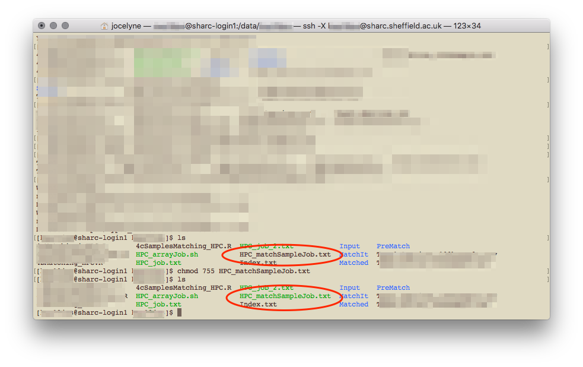

```{r setup, include=FALSE}
knitr::opts_chunk$set(echo = TRUE)
```

## Starting a job
Once logged in, you can use the HPC in interactive mode or to submit a batch job. I find it easier to start in interactive mode to see how it works and have a play around. If you've got everything written out and you just need the computer to do the work though, running a batch job is much easier and the job scheduler SGE will run the job without you worrying about it.

## In interactive mode
### Request a worker node
First we need to request for a worker node
```{bash, eval=FALSE}
qrshx -l rmem=16G -pe smp 4 
```

* `qrshx` supports graphical applications, as does `qsh`. The former is specific to Sheffield's clusters and is supposedly superior to the latter. `qrsh` does not support graphical applications, only command line shell
* `-l rmem=XXG` requests for specific real memory resources. Here I've asked for 16GB of memory; the default is 2GB, and the max one can request is 256GB. The amount of memory you're requesting for is for each core; so if you're requesting for four cores and you need 8G of RAM in total, you only need to request for 2G of rmem.
* `-pe smp X` requests for X number of cores on the same node. This is only useful if you're parallelising your code. `smp` stands for shared memory parallelisation where you're sharing the memory (in the case of Sheffield's HPC, all the cores have to be on the same node). On Iceberg, instead of `smp` it's `openmp`. The default number of core allocated is one and the max one can request is 16. 


You might have to wait a while to be allocated a worker node, or your request for a node might be rejected (for that particular time). Once you're allocated a node, the name changes from `[UserName@sharc-loginX ~]` to `[UserName@sharc-nodeXXX ~]`.

### Load R
Once you're on a worker node, you can open or load applications.

```{bash, eval=FALSE}
module load apps/R/3.6.3/gcc-8.2.0
```

This loads the particular version of R available on the HPC, which also happens to be the latest at this point in time. To load the latest without specifying which version, use `module load apps/R`.


If you're going to use R for spatial analyses, you'll likely be using the R packages `rgdal` and `spdep` amongst others. To install and to use these packages, you'll need to load the relevant libraries *before* you enter the R environment and try to load the packages. If you have issues installing a certain package, check through the error messages and see if you need to load an external library (like gdal, proj etc.) and check if the library already exists on the HPC system with `module avail` in the worker node. Otherwise, flag it up to the really helpful and wonderful people at `hpc[at]sheffield[dot]ac[dot]uk`. 

```{bash, eval=FALSE}
# for rgdal
module load libs/gdal/2.2.0/gcc/gcc-4.9.4
module load libs/proj/4.9.3/gcc-4.9.4
# for spdep
module load libs/udunits/2.2.26/gcc-4.9.4
module load libs/gdal/2.2.0/gcc/gcc-4.9.4
module load libs/proj/4.9.3/gcc-4.9.4
module load libs/geos/3.6.1/gcc-4.9.4
# for rgeos
module load libs/geos/3.6.1/gcc-4.9.4
```


In the above screenshot, I loaded R version 3.5.1, because according to the website, that was the latest version available. You can find out what modules/R versions are available on the system with `module avail` once you're logged in to the HPC.

If you're using the HPC interactively, to quit R, type `quit()` or `q()`. You will still be on a worker node, and to leave it, type `exit`. To leave the HPC system altogether, type `exit` again. You can open multiple terminal windows to, for example have R on one in a worker node, and just be logged in to the system to view files on the other. 

### Installing packages you need
When you first install packages, you need to create a home folder, which will be specific to each version of R you use.

When you type `install.packages('packageName')` in R, you will receive a warning, and respond that `yes`, you would like to use a personal library, and again that `yes`, you would like to create a personal library. 


You'll then have to select which CRAN mirror (I use 50, Bristol) to use. Subsequent packages that you install will automatically go into your personal library. To check what packages have been installed, in the head node (not in the R session), type `ls ~/R/x86_64-pc-linux-gnu-library/3.6/`. Or whatever version of R you might be using.

## In a scheduled batch job (serial)
Useful if you need substantial resources (>8 hours, or a few cores). You are allowed to submit up to 2000 jobs to the ShARC cluster and the scheduler will allow up to 200 of your jobs to run simultaneously (depending on the load on the cluster) [more here under FAQ](https://docs.hpc.shef.ac.uk/en/latest/hpc/scheduler/submit.html). The following guidance is for writing a serial batch job, where only one core is used. For parallel computing, see below section on [Parallel computing on the HPC cluster](#Learning-how-to-parallelise)

### Writing a bash script
A bash script is needed to submit a scheduled job. You can use a plain text editor like TextEdit on Mac OS to write it (which is what I've done). It seems that if you use Windows, it would be better to use Notepad++ and save the file in UNIX/OSX format, or to just use the terminal to write the bash shell script with a text editor. This is because Windows and Unix-like systems use different end-of-line characters in text files.

Start with a shebang (shell bang) `#!` for a bash script, specify various arguments (in SGE speech, not slurm), and call Rscript to run your R script. Here's an example

```{bash, eval=FALSE}
#!/bin/bash`
#$ -l h_rt=10:00:00
#$ -l rmem=16G
#$ -N jobName
#$ -M UserName@email.address
#$ -m bea
#$ -o /file/path/to/Output.txt
#$ -j y

cd /file/directory/you/want

module load apps/R/3.6.3/gcc-8.2.0

Rscript myTestScript.R
```
* `#$ -l h_rt=XX:XX:XX` specifies the running time for the script in HH:MM:SS. After this time, the job will be killed regardless of its status (even if it hasn't finished!). The current maximum allowed is 96 hours (4 days) for ShARC and 168 hours (7 days) for Iceberg.
* `#$ -l rmem=XXXG` specifies the amount of memory (for each core) required. If the job exceeds the allocated memory, the job will also be killed. 256G is the maximum available (since that's the maximum amount of memory available for a node). 
* `#$ -N` specifies the name you want to give to the job, makes it easier to keep track of multiple jobs you're submitting, rather than trying to remember the job numbers for each of them.
* `#$ -M` specifies the email address you want updates to be sent to.
* `#$ -m bea` tells it to send an email (to the above specified address) when the job begins, ends, or is aborted.
* `#$ -o` specifies the output file. If you don't specify the file path, the output file will be in the working directory.
* `#$ -j y` tells it to join the error and output file. Alternatively, if you want separate error and output files, use `-e /file/path/to/Error.txt` instead.
* `cd` changes the directory to the one that the job should be running from. I had previously used `#$ -wd` to do this but apparently `cd` is more reliable... 
* the module load command is the same as what you would call in an interactive job
* `Rscript` runs the R script you have written. There are a few other ways of getting your R script done, such as `R CMD BATCH` and `littler` but apparently the former is terrible and I've not tried the latter.


Once you've got your bash script written, you need to make it executable. Go to your terminal again:
```{bash, eval=FALSE}
cd directory/your/bash/script/is/in
chmod 755 bashScript.ext
```
It apparently doesn't matter what your file extension is, whether it's .sh or .txt. It changes colour when the file has been made executable.




Once you've got your R script (written as you normally would, but make sure it doesn't require any interactive input) and your bash script written and saved to a directory that's accessible on the HPC, you're good to go! It's a generally good idea to test it out before submitting your real job.

#### Writing an executable R script
It seems there's another way of doing this which is to make your R script executable itself, and have your R script start with a shebang. I have not tried this and am not sure how it works. 

So your R script would look something like that
```{R, eval=FALSE}
#!/usr/bin/env Rscript

setwd('if/you/need/it')
library('Package')

# ... rest of script as normal
```

After you've done that, you need to make that R script executable by going to terminal and typing
`chmod +x myRScript.R`

Then you can apparently run the R script directly in Terminal, with `./myRscript.R` ...

### Submitting your batch job
Back in terminal, make sure you're connected on the VPN, logged in to the HPC using `ssh`. From the head node, you can submit your batch job with
```{bash, eval=FALSE}
qsub file/path/to/bashScript.ext
```


And that's it! Or, you can also navigate to the directory that your bash script sits in with `cd`, and run `qsub bashScript.ext` from there. 

If you've used the `-M` and `-m bea` options and submitted your job, the email sent to you when that job completes (assuming you've ) will tell you the maximum memory that job needed (**Max vmem**), and you can use that to determine the `-l rmem=XXG` parameter for your next job. 


After submitting your job, you can exit the HPC with `exit`. To check on the job, you have to log back in (making sure you're connected to VPN), and type `qstat`. This gives an update on all the jobs you have submitted. To get more details on a specific job, type `qstat -F -j JOB_NUMBER`


If you run into errors, you can also debug by going into interactive mode, loading the R module (but not running it) and try `Rscript myTestScript.R` to see what went wrong.
