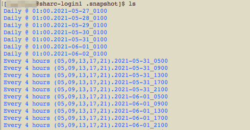

```{r setup, include=FALSE}
knitr::opts_chunk$set(echo = TRUE)
```

## Backing up files
Data management is very important, needless to say, and losing data can be pretty detrimental and mean days or weeks of repeating the same work. There are two ways of having safeguards for files being accidentally lost: [snapshots](https://docs.hpc.shef.ac.uk/en/latest/glossary.html#term-Snapshotted-storage) and backups. Snapshot refers to copying the entire directory at various frequencies (e.g. four-hourly or daily) and retaining it for certain duration (e.g. for 7 days), while backup means it's saved in a different place (e.g. in an external hard drive), just in case something happens to that particular storage space.

Check here to find out [the different storage areas available](https://docs.hpc.shef.ac.uk/en/latest/hpc/filestore.html) to users of the University of Sheffield's HPC and the differences between them. Here, I focus on the data directory which is the main directory I use for storing my files on ShARC, since it has 100GB capacity. It has a four-hourly snapshot and a nightly snapshot, with the 10 most recent four-hourly snapshots and the last 7 days of nightly snapshots retained. So if you save your files here, and accidentally deleted some files, you have 7 days to retrieve them before they are really gone. For the home directory on ShARC, nightly snapshots are retained for the last 28 days.

## Retrieving files

First, navigate to the snapshots. They're in a hidden folder, so you cannot see/access them by using `ls` normally and need to explicitly navigate to the folder.

``` {bash, eval=FALSE}
cd /data/YourUserName/.snapshot
ls 
```

You should see the contents of your snapshot folder looking something like this.



You can then look through the different snapshotted back-ups with `cd` or `ls` to either change directory or list what's in those folders. You'll need to have single or double quotation marks around the folder names as they contain spaces, e.g. `cd "Daily @ 01:00.2021-05-31_0100"`.

Once you've found the file you've accidentally deleted, copy it back to your home or data directory with `cp`, remembering how your file paths are set. In this case, I am in one of the Daily snapshot folder and I'm transferring a file from the snapshotted Input folder into the data directory's Input folder.

``` {bash, eval=FALSE}
cp Input/FileThatIDeleted.csv /data/YourUserName/Input
```

